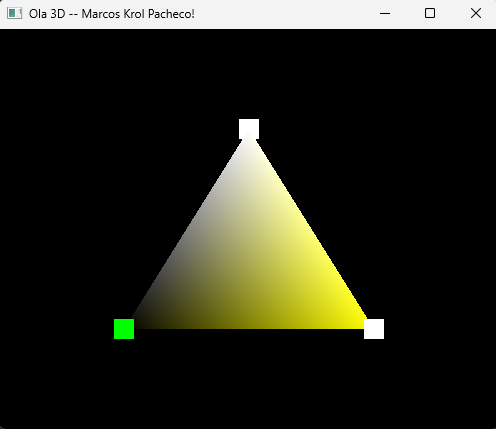

# Módulo 01 - Configuração de ambiente

No primeiro módulo de atividade academica, foi realizada a configuração do ambiente para desenvolvimento, bem como alterado o exemplo Hello3D, modificando o titulo e as cores do triângulo.

